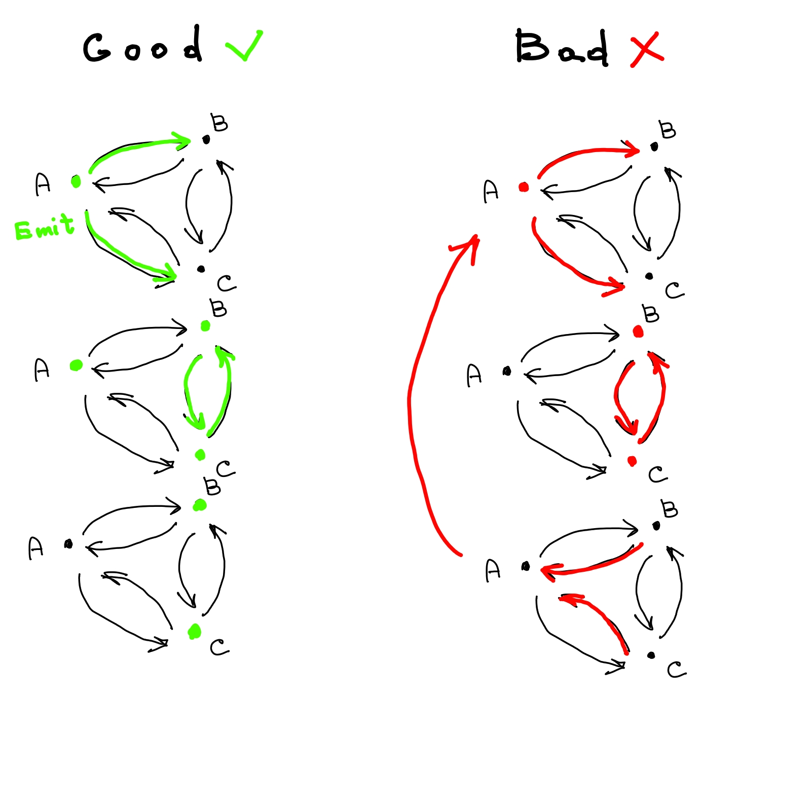

# Cyber-Physical systems source task implementations

## Network tasks
Using Python, NetworkX and Matplotlib make:

1) develop broadcast model and model "broadcast storm";
2) develop model without storm;
3) estimate needed time for utility structures in Model II;
4) improve Model II to remove utility structures just in time.

Original:

> Використовуючи мову програмування Python 3 і бібліотеку NetworkX
> 1) розробити модель розповсюдження інформаціїї за схемою "broadcast", продемонструвати ефект "broadcast storm";
> 2) розробити покращену модель за схемою "broadcast", яка не призводить до ефекту "broadcast storm";
> 3) оцінити необхідний час життя допоміжних структур для протоколу, що Ви побудували у п. 2;
> 4) удосконалити модель п.2, забезпечивши своєчасне видалення допоміжних структур.

### Instructions

1) dependencies: `python3.6`, `networkx-2.2`, `matplotlib-3`;
2) you **CAN** run `pip install -r requirements.txt` to install versions I have;
3) run `python <script> [--help]` to run any of them.

### 1st and 2nd tasks
Basically, every step every node gets its income messages
and put them into every other channel. 2nd model sets flag on
if it did some broadcasting, but never set its off.

### 3rd task — explanation
Let's say we have a node *A* with *n* channels.
Each channel has <i>Tmax emitk</i> as guaranteed maximum time 
for emitted message to arrive to nth neighbour
and <i>Tmax arrivek</i> to arrive from nth neighbour.
Also lets assume that message processing and remiting on nodes is instantaneous and atomic.
So it is needed for every node to wait <i>T = max(Tmax arrivek+Tmax emitk)</i> 
time to delete table record for a message. It is basically a defence against
bad cases defined below (when two identical messages received in the same time). 
If you have different speeds for edges of the network
the algorithm will create "safe zone" (means that the node will 
not receive the same message from it's neighbours ever) 
around a node for <i>max(Tmax emitk)</i> 
time which can be much less than *T*.

### 4th task

Following formula above, out temporary structure ("broadcast table") exists only for 2 steps
(as all channel speeds in model are "1 step"):

1. initial step, when the message remitted, preventing case
   when there is multiple same messages in other channels.
   But it not preventing remitment to channels from which duplicates
   will arrive as the node at the moment cannot know about it because
   messages are processed sequentially.
2. next step, to prevent "triangle" case when some nodes A-B-C 
   connected as triangle and some of them emits message to two others,
   so they emits the message to neighbor and receives it in the next step.
   
   And also to prevent case when simultaneous emit of a message to 
   the same node produces "leak" of the message to one of emitting node 
   (preventing "leaking" multiple identical simultaneous messages 
   that arrive to some node).
   

Pretty good results can be seen running this:
`python network-4.py -v=10 -p=0.2 -n=20 -b=0.4 -s=8460`
